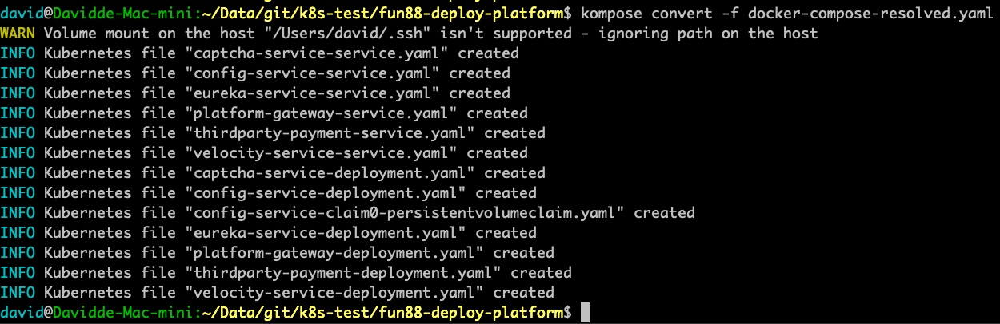
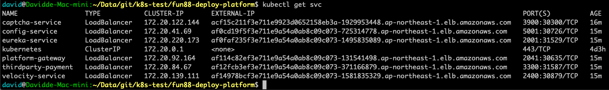

kompose usgae
===


## Table of Contents

[TOC]

## Setup for enviorment

### Step.1 Innstall kompose
---
```gherkin=
brew install kompose
```
(kompose version 1.18.0)

### Step.2 Get deploy and config from git
---
```gherkin=
git clone -b prod/1.2.0 git@gitlab.funpodium.net:devops/fun88-deploy-platform.git
git clone -b prod/1.2.0 git@gitlab.funpodium.net:devops/fun88-config-platform.git
```

## Kompose Convert Steps

### Step.0 Precondition
---
issue 1: use backend-stage-sshkey ?
todo 1: find and re-match this ssh key.

```gherkin=
WARN Volume mount on the host "/Users/david/.ssh" isn't supported - ignoring path on the host
```
issue 2: local host volume with docker-compose.yml
todo 2: change the volume setting or kompose add parameter.

issue 3: service expose?
todo 3: change the docker-compose.yml brfore converting.

kompose.service.type 定义要创建的 Service 类型。
```gherkin=
labels:
      kompose.service.type: nodeport / clusterip / loadbalance
````
kompose.service.expose 定义 是否允许从集群外部访问 Service。如果该值被设置为 “true”，提供程序将自动设置端点，对于任何其他值，该值将被设置为主机名。如果在 Service 中定义了多个端口，则选择第一个端口作为公开端口。
```gherkin=
    labels:
      kompose.service.expose: "true / hostname"
```

### Step.1 Kompose replacing environment variables from .env file
---
```gherkin=
rm -f *-service.yaml *-deployment.yaml *-ingress.yaml *-persistentvolumeclaim.yaml
cp -f fun88-config-platform/platform/.env fun88-deploy-platform/
sed -i '' 's|/root/.ssh/id_rsa|../root/.ssh/id_rsa|g' fun88-deploy-platform/.env
grep CONFIG_SERVICE_SSH_PRIVATE_KEY fun88-deploy-platform/.env
cd fun88-deploy-platform/
docker-compose config > docker-compose-resolved.yaml
sed -i '' 's|/Users/david/.ssh|../root/.ssh/|g' docker-compose-resolved.yaml
grep .ssh docker-compose-resolved.yaml
```

### Step.2 Clear Old yaml files
---
```gherkin=
rm -f *-service.yaml *-deployment.yaml *-ingress.yaml *-persistentvolumeclaim.yaml
```

### Step.3a Convert to Kubernetes
---
```gherkin=
kompose convert -f docker-compose-resolved.yaml
```

### Step.3b Convert to Kubernetes with local host path
---
```gherkin=
kompose convert --volumes hostPath -f docker-compose-resolved.yaml
```



### Step.4 generate the command for create k8s components
---
COPY the output of 'kompose convert' into /tmp/tmp

output like this.
```console
INFO Kubernetes file "captcha-service-service.yaml" created
INFO Kubernetes file "config-service-service.yaml" created
INFO Kubernetes file "eureka-service-service.yaml" created
INFO Kubernetes file "platform-gateway-service.yaml" created
INFO Kubernetes file "thirdparty-payment-service.yaml" created
INFO Kubernetes file "velocity-service-service.yaml" created
INFO Kubernetes file "captcha-service-deployment.yaml" created
INFO Kubernetes file "config-service-deployment.yaml" created
INFO Kubernetes file "config-service-claim0-persistentvolumeclaim.yaml" created
INFO Kubernetes file "eureka-service-deployment.yaml" created
INFO Kubernetes file "platform-gateway-deployment.yaml" created
INFO Kubernetes file "thirdparty-payment-deployment.yaml" created
INFO Kubernetes file "velocity-service-deployment.yaml" created
```
And then run
```gherkin=
cat /tmp/tmp|grep 'INFO'|awk -F'\"' '{print $2}'|sed -e ':a' -e 'N' -e '$!ba' -e 's/\n/,/g'|sed 's|^|kubectl create -f |g'
```

### Step.5 Configuation for k8s auth
---
```gherkin=
export KUBECONFIG=/Users/david/Data/git/aws-eks-lab/conf/k8s-sert/credential
```

### Step.6a Create ALL
---
```gherkin=
kubectl create -f captcha-service-service.yaml,config-service-service.yaml,eureka-service-service.yaml,platform-gateway-service.yaml,thirdparty-payment-service.yaml,velocity-service-service.yaml,captcha-service-deployment.yaml,captcha-service-ingress.yaml,config-service-deployment.yaml,config-service-ingress.yaml,eureka-service-deployment.yaml,eureka-service-ingress.yaml,platform-gateway-deployment.yaml,platform-gateway-ingress.yaml,thirdparty-payment-deployment.yaml,thirdparty-payment-ingress.yaml,velocity-service-deployment.yaml,velocity-service-ingress.yaml
```

### Step.6b Create ALL with local host path
---
```gherkin=
kubectl create -f captcha-service-service.yaml,config-service-service.yaml,eureka-service-service.yaml,platform-gateway-service.yaml,thirdparty-payment-service.yaml,velocity-service-service.yaml,captcha-service-deployment.yaml,captcha-service-ingress.yaml,config-service-deployment.yaml,config-service-ingress.yaml,config-service-claim0-persistentvolumeclaim.yaml,eureka-service-deployment.yaml,eureka-service-ingress.yaml,platform-gateway-deployment.yaml,platform-gateway-ingress.yaml,thirdparty-payment-deployment.yaml,thirdparty-payment-ingress.yaml,velocity-service-deployment.yaml,velocity-service-ingress.yaml
```

### Step.99 Delete ALL
---
```gherkin=
kubectl delete -f captcha-service-service.yaml,config-service-service.yaml,eureka-service-service.yaml,platform-gateway-service.yaml,thirdparty-payment-service.yaml,velocity-service-service.yaml,captcha-service-deployment.yaml,captcha-service-ingress.yaml,config-service-deployment.yaml,config-service-ingress.yaml,config-service-claim0-persistentvolumeclaim.yaml,eureka-service-deployment.yaml,eureka-service-ingress.yaml,platform-gateway-deployment.yaml,platform-gateway-ingress.yaml,thirdparty-payment-deployment.yaml,thirdparty-payment-ingress.yaml,velocity-service-deployment.yaml,velocity-service-ingress.yaml
```

### Step.7 Verify
---
```gherkin=
ls -l *-service.yaml|wc -l
ls -l *-deployment.yaml|wc -l
ls -l *-ingress.yaml|wc -l
kubectl describe svc frontend
kubectl get deployment,svc,pods
```



## Other Selection: Convert to Helm

### Step.1 Convert to Helm
---
```gherkin=
kompose convert -c -f docker-compose-resolved.yaml
```

### Step.2 Convert to Helm with local host path
---
```gherkin=
kompose convert --volumes hostPath -c -f docker-compose-resolved.yaml
```

# --- END --- #
